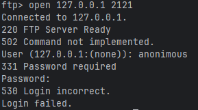
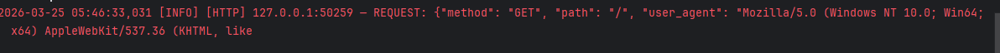
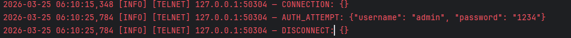

# 🍯 PyHoneypot

> A lightweight, multi-service cyber deception tool built in Python — designed to detect, log, and report unauthorized access attempts in real time.


---

## 📖 Overview

**PyHoneypot** is a command-line cybersecurity tool that simulates real network services — SSH, FTP, HTTP, and Telnet — as convincing decoys. Any actor that connects to these services is silently profiled and logged, with a structured JSON report automatically generated at the end of each session.

Unlike real services, these listeners grant no actual access. The attacker interacts with an illusion while every credential attempt, command, and payload they submit is recorded and saved for analysis.

This project is part of a broader [Cybersecurity Portfolio](https://github.com/Don-cybertech/cybersecurity_portfolio) of hands-on Python security tools.

---

## 📸 Screenshots

### Honeypot Startup — All four services active


---

### SSH Capture — Connection attempt logged in real time


---

### FTP Capture — Login attempt intercepted



---

### HTTP Capture — GET request logged with user agent



---

### Telnet Capture — Login attempt intercepted



---

### Auto-generated JSON Report


---

## ✨ Features

| Feature | Description |
|---|---|
| 🎭 **Service Emulation** | Realistic SSH, FTP, HTTP, and Telnet decoys with authentic banners |
| 🖥️ **CLI Interface** | Flexible flags to run all services or individual ones |
| 📋 **Structured Logging** | Timestamped logs capturing IPs, credentials, commands, and payloads |
| 📊 **Auto-Report Generation** | JSON session report saved every 60 seconds and on shutdown |
| 🔌 **Concurrent Connections** | Built on Python `asyncio` — handles multiple attackers simultaneously |
| 🧩 **Attacker Profiling** | Tracks every IP across services — connections, credentials, and commands |
| ⚡ **Zero-Dependency Core** | Built entirely on Python's standard library |

---

## 🛠️ Supported Services

| Service | Port | Mimics | Protocol | What It Captures |
|---------|:----:|:------:|:--------:|-----------------|
| **SSH** | `2222` | Port 22 | TCP | Usernames, passwords, shell commands |
| **FTP** | `2121` | Port 21 | TCP | Credentials, FTP commands, file transfer attempts |
| **HTTP** | `8080` | Port 80 | TCP | GET/POST requests, form data, Basic Auth headers |
| **Telnet** | `2323` | Port 23 | TCP | Usernames, passwords, shell commands, payloads |

---

## ⚙️ How It Works

```
┌──────────────────────────────────────────────────────────────────┐
│                        PYHONEYPOT FLOW                           │
└──────────────────────────────────────────────────────────────────┘

  ATTACKER                  HONEYPOT                   ANALYST
     │                          │                          │
     │── Scan / Connect ────────►│                          │
     │                          ├── Log: IP + Timestamp ───►│
     │◄── Fake Service Banner ───┤                          │
     │                          │                          │
     │── Submit Credentials ────►│                          │
     │                          ├── Log: Username/Password ►│
     │◄── Fake Auth Response ────┤                          │
     │                          │                          │
     │── Send Commands/Data ────►│                          │
     │                          ├── Log: Payload/Commands ──►│
     │◄── Simulated Response ────┤                          │
     │                          │                          │
     │── Disconnect ────────────►│                          │
     │                          ├── Auto-Save JSON Report ──►│
     │                          │   (events + unique IPs)   │
```

**Lifecycle:**

1. **Startup** — Honeypot binds to ports 2222, 2121, 8080, and 2323 and begins listening
2. **Connection** — An attacker or automated scanner connects to an open port
3. **Emulation** — A realistic service banner convinces the attacker the service is genuine
4. **Capture** — All interaction data (credentials, commands, HTTP requests) is silently recorded
5. **Logging** — Each event is timestamped and written to `honeypot.log`
6. **Reporting** — Every 60 seconds and on exit, a full JSON report is saved to `honeypot_report.json`

---

## 📁 Project Structure

```
05_honeypot/
│
├── honeypot.py            # Single-file entry point — all services, CLI, and reporting
├── honeypot.log           # Auto-created at runtime — live timestamped event log
├── honeypot_report.json   # Auto-generated session report (JSON)
├── requirements.txt       # Project dependencies
├── screenshots/           # Terminal screenshots for documentation
│   ├── startup.png
│   ├── ssh_capture.png
│   ├── telnet_capture.png
│   └── report.png
└── README.md
```

---

## 📋 Requirements

- **Python 3.11+** *(required for `asyncio.TaskGroup` support)*
- pip

```bash
pip install -r requirements.txt
```

---

## 🚀 Installation

**1. Clone the repository**

```bash
git clone https://github.com/Don-cybertech/pyhoneypot.git
cd pyhoneypot/05_honeypot
```

**2. Create and activate a virtual environment** *(recommended)*

```bash
python -m venv .venv

# Windows
.venv\Scripts\activate
```

**3. Install dependencies**

```bash
pip install -r requirements.txt
```

---

## 💻 Usage

### Start all services at once

```bash
python honeypot.py --all
```

### Start specific services individually

```bash
python honeypot.py --ssh          # SSH    only  (port 2222)
python honeypot.py --ftp          # FTP    only  (port 2121)
python honeypot.py --http         # HTTP   only  (port 8080)
python honeypot.py --telnet       # Telnet only  (port 2323)
```

### Combine multiple services

```bash
python honeypot.py --ssh --http
python honeypot.py --ssh --ftp --telnet
```

> **No flags?** Running without any arguments automatically starts all four services — same as `--all`.

---

## 📊 Live Output & Logs

### Console output when running `--all`

```
2026-03-23 14:45:20  [+] SSH    honeypot listening on :2222
2026-03-23 14:45:20  [+] FTP    honeypot listening on :2121
2026-03-23 14:45:20  [+] HTTP   honeypot listening on :8080
2026-03-23 14:45:20  [+] Telnet honeypot listening on :2323
2026-03-23 14:45:20  [*] Honeypot active. Waiting for attackers...

2026-03-23 14:46:10  🔌 [SSH]    192.168.1.105:54321 → connect
2026-03-23 14:46:12  🔑 [SSH]    192.168.1.105:54321 → auth_attempt | {'username': 'root', 'password': 'admin123'}
2026-03-23 14:46:44  🔌 [Telnet] 192.168.1.105:61234 → connect
2026-03-23 14:46:46  🔑 [Telnet] 192.168.1.105:61234 → auth_attempt | {'username': 'admin', 'password': '1234'}
2026-03-23 14:47:02  💻 [HTTP]   45.33.32.156:60234  → command     | GET /admin HTTP/1.1...
2026-03-23 14:47:18  🔌 [FTP]    185.220.101.9:44012 → connect
2026-03-23 14:47:20  🔑 [FTP]    185.220.101.9:44012 → auth_attempt | {'username': 'anonymous', 'password': 'guest'}
2026-03-23 14:48:20  [+] Report saved — 7 events, 3 unique IPs
```

### Auto-generated JSON report (`honeypot_report.json`)

```json
{
  "events": [
    {
      "timestamp": "2026-03-25T07:30:16.900844",
      "service": "FTP",
      "src_ip": "127.0.0.1",
      "src_port": 24689,
      "event": "auth_attempt",
      "data": { "username": "anonymous", "password": "guest" }
    },
    {
      "timestamp": "2026-03-25T07:30:52.147228",
      "service": "Telnet",
      "src_ip": "127.0.0.1",
      "src_port": 24716,
      "event": "auth_attempt",
      "data": { "username": "admin", "password": "1234" }
    }
  ],
  "attacker_profiles": {
    "127.0.0.1": {
      "connections": 6,
      "services": ["FTP", "Telnet"],
      "credentials": [
        { "username": "anonymous", "password": "guest" },
        { "username": "admin", "password": "1234" }
      ],
      "commands": []
    }
  }
}
```

The report saves every **60 seconds** and again on shutdown — no data is lost if the honeypot is stopped mid-session.

---

## 🧪 Testing the Honeypot

Start the honeypot in one terminal, then interact with it from a **second terminal**:

**SSH**
```bash
ssh root@127.0.0.1 -p 2222
# Type any password when prompted — it will be captured in the log
```

**FTP**
```bash
ftp 127.0.0.1 2121
# Try: anonymous / guest — or any username/password combination
```

**HTTP**
```bash
# Browser — open any of these URLs
http://127.0.0.1:8080
http://127.0.0.1:8080/admin

# curl
curl http://127.0.0.1:8080
curl -X POST http://127.0.0.1:8080/login -d "username=admin&password=secret"
```

**Telnet**
```bash
telnet 127.0.0.1 2323
# Type any username and password — both are captured and logged
```

> **Windows Telnet not installed?** Enable it via:
> Control Panel → Programs → Turn Windows features on/off → Telnet Client

---

## 🎯 Use Cases

| Context | Application |
|---|---|
| **Home Lab** | Monitor real-world scanning and brute-force patterns on your own network |
| **Security Research** | Capture attack payloads and credential lists used in the wild |
| **Intrusion Detection** | Deploy internally to detect lateral movement within a network |
| **Education / CTF** | Safely study attacker behaviour without exposing real systems |
| **Portfolio / Interview** | Demonstrate hands-on network security and async Python skills |

---

## 🗺️ Roadmap

- [ ] SMTP / MySQL decoy service modules
- [ ] GeoIP lookup for attacker IP addresses
- [ ] Real-time web dashboard for log visualisation
- [ ] Email / Slack alerting on new connections
- [ ] Docker support for containerised deployment
- [ ] Custom port configuration via config file

---

## ⚖️ Ethical & Legal Disclaimer

> **This tool is intended strictly for:**
> - Authorised penetration testing and security research
> - Educational, academic, and portfolio purposes
> - Deployment on systems and networks you **own** or have **explicit written permission** to monitor

By using this software, you agree that:

- You will **not** deploy this tool on systems or networks you do not own or control
- You will **not** use any captured data for harassment, retaliation, or illegal activity
- Compliance with all applicable local, national, and international laws is your **sole responsibility**
- The author assumes **no liability** for damages or legal consequences arising from misuse

> ⚠️ Deploying a honeypot on infrastructure you do not own may constitute unauthorised interception of communications — a criminal offence in most jurisdictions.

--

---

## 📄 License

This project is licensed under the **MIT License** — see the [LICENSE](LICENSE) file for details.

---

## 👤 Author

**Egwu Donatus Achema**

GitHub: [@Don-cybertech](https://github.com/Don-cybertech)

LinkedIn: (https://www.linkedin.com/in/egwu-donatus-achema-8a9251378)

Part of: [Cybersecurity Portfolio](https://github.com/Don-cybeertech/cybersecurity_portfolio)

---

<div align="center">

*Built with 🐍 Python · Powered by asyncio · Part of a hands-on cybersecurity portfolio*

⭐ Star this repo if you found it useful!

</div>
